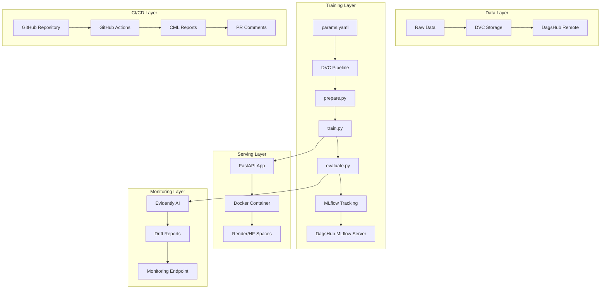

# Design Document: End-to-End MLOps Pipeline

## Overview

This document describes the technical design for an End-to-End MLOps Pipeline for wine quality classification. The system implements a complete ML lifecycle including data versioning, experiment tracking, reproducible pipelines, CI/CD automation, model serving, monitoring, and multi-model comparison.

### Technology Stack

| Component | Technology | Purpose |
|-----------|------------|---------|
| Data Versioning | DVC + DagsHub | Track and version datasets |
| Experiment Tracking | MLflow + DagsHub | Log parameters, metrics, artifacts |
| Pipeline Orchestration | DVC Pipelines | Reproducible ML workflows |
| CI/CD | GitHub Actions + CML | Automated testing and reporting |
| Model Serving | FastAPI | REST API for predictions |
| Containerization | Docker | Consistent deployment |
| Monitoring | Evidently AI | Data drift detection |
| Code Quality | pytest, ruff, black | Testing and linting |

## Architecture

### High-Level Architecture



### Project Structure

```
mlops-pipeline/
├── .github/
│   └── workflows/
│       ├── cml.yaml              # ML pipeline workflow
│       └── ci.yaml               # Tests and linting workflow
├── .dvc/
│   └── config                    # DVC remote configuration
├── configs/
│   └── params.yaml               # Hyperparameters and model configs
├── data/
│   ├── raw/
│   │   └── wine_quality.csv.dvc  # DVC-tracked raw data
│   └── processed/
│       ├── train.csv             # Training set (DVC-tracked)
│       └── test.csv              # Test set (DVC-tracked)
├── models/
│   └── model.pkl                 # Trained model artifact
├── reports/
│   ├── metrics.json              # Evaluation metrics
│   └── drift_report.html         # Evidently drift report
├── src/
│   ├── __init__.py
│   ├── data/
│   │   ├── __init__.py
│   │   └── prepare.py            # Data preparation stage
│   ├── models/
│   │   ├── __init__.py
│   │   ├── train.py              # Training stage
│   │   └── evaluate.py           # Evaluation stage
│   ├── monitoring/
│   │   ├── __init__.py
│   │   └── drift.py              # Data drift detection
│   └── api/
│       ├── __init__.py
│       ├── app.py                # FastAPI application
│       └── schemas.py            # Pydantic models
├── tests/
│   ├── __init__.py
│   ├── test_data.py              # Data preparation tests
│   ├── test_model.py             # Model training tests
│   └── test_api.py               # API endpoint tests
├── .dvcignore
├── .gitignore
├── .pre-commit-config.yaml       # Pre-commit hooks
├── dvc.yaml                      # DVC pipeline definition
├── dvc.lock                      # DVC pipeline lock file
├── Dockerfile
├── docker-compose.yaml
├── pyproject.toml                # Project dependencies and tools config
├── requirements.txt              # Production dependencies
├── requirements-dev.txt          # Development dependencies
└── README.md
```

## Components and Interfaces

### 1. Data Preparation Component

**File:** `src/data/prepare.py`

**Purpose:** Load raw data, perform preprocessing, and split into train/test sets.

**Interface:**
```python
def load_data(data_path: str) -> pd.DataFrame:
    """Load raw wine quality dataset."""
    pass

def preprocess_data(df: pd.DataFrame) -> pd.DataFrame:
    """Clean and preprocess data (handle missing values, outliers)."""
    pass

def split_data(
    df: pd.DataFrame, 
    test_size: float = 0.2, 
    random_state: int = 42
) -> tuple[pd.DataFrame, pd.DataFrame]:
    """Split data into training and test sets."""
    pass

def main(config_path: str = "configs/params.yaml") -> None:
    """Main entry point for data preparation stage."""
    pass
```

**Dependencies:**
- Input: `data/raw/wine_quality.csv`
- Output: `data/processed/train.csv`, `data/processed/test.csv`
- Config: `configs/params.yaml`

### 2. Model Training Component

**File:** `src/models/train.py`

**Purpose:** Train ML models with MLflow tracking and support for multiple model types.

**Interface:**
```python
def get_model(model_name: str, params: dict) -> BaseEstimator:
    """Factory function to create model instance based on config."""
    pass

def train_model(
    X_train: pd.DataFrame, 
    y_train: pd.Series, 
    model_name: str,
    params: dict
) -> BaseEstimator:
    """Train a single model with given parameters."""
    pass

def train_all_models(
    X_train: pd.DataFrame, 
    y_train: pd.Series, 
    config: dict
) -> dict[str, BaseEstimator]:
    """Train all models specified in config."""
    pass

def save_model(model: BaseEstimator, path: str) -> None:
    """Save trained model to disk."""
    pass

def main(config_path: str = "configs/params.yaml") -> None:
    """Main entry point for training stage."""
    pass
```

**Supported Models:**
- RandomForestClassifier
- GradientBoostingClassifier
- LogisticRegression
- XGBClassifier (optional)

**MLflow Integration:**
```python
with mlflow.start_run(run_name=model_name):
    mlflow.log_params(params)
    model = train_model(X_train, y_train, model_name, params)
    mlflow.log_metric("training_time", training_time)
    mlflow.sklearn.log_model(model, "model")
```

### 3. Model Evaluation Component

**File:** `src/models/evaluate.py`

**Purpose:** Evaluate trained models, compute metrics, and select best model.

**Interface:**
```python
def load_model(model_path: str) -> BaseEstimator:
    """Load trained model from disk."""
    pass

def compute_metrics(
    y_true: pd.Series, 
    y_pred: np.ndarray
) -> dict[str, float]:
    """Compute classification metrics."""
    pass

def evaluate_model(
    model: BaseEstimator, 
    X_test: pd.DataFrame, 
    y_test: pd.Series
) -> dict[str, float]:
    """Evaluate model and return metrics."""
    pass

def select_best_model(
    metrics: dict[str, dict[str, float]], 
    metric_name: str = "f1_score"
) -> str:
    """Select best model based on specified metric."""
    pass

def save_metrics(metrics: dict, path: str) -> None:
    """Save metrics to JSON file."""
    pass

def main(config_path: str = "configs/params.yaml") -> None:
    """Main entry point for evaluation stage."""
    pass
```

**Metrics Computed:**
- Accuracy
- Precision (weighted)
- Recall (weighted)
- F1-Score (weighted)
- Confusion Matrix

### 4. Data Drift Monitoring Component

**File:** `src/monitoring/drift.py`

**Purpose:** Detect data drift using Evidently AI and generate reports.

**Interface:**
```python
def load_reference_data(path: str) -> pd.DataFrame:
    """Load reference (training) data for comparison."""
    pass

def compute_drift_report(
    reference_data: pd.DataFrame, 
    current_data: pd.DataFrame
) -> Report:
    """Generate Evidently drift report."""
    pass

def check_drift_threshold(
    report: Report, 
    threshold: float = 0.1
) -> dict[str, bool]:
    """Check if drift exceeds threshold for each feature."""
    pass

def save_drift_report(report: Report, path: str) -> None:
    """Save HTML drift report."""
    pass

def get_drift_summary(report: Report) -> dict:
    """Extract drift summary for API response."""
    pass
```

**Evidently Metrics:**
- DataDriftPreset
- DataQualityPreset
- ColumnDriftMetric (per feature)

### 5. FastAPI Application Component

**File:** `src/api/app.py`

**Purpose:** Serve model predictions via REST API.

**Endpoints:**

| Method | Endpoint | Description |
|--------|----------|-------------|
| GET | `/` | Root endpoint with API info |
| GET | `/health` | Health check |
| POST | `/predict` | Get wine quality prediction |
| POST | `/predict/batch` | Batch predictions |
| GET | `/monitoring/drift` | Get drift status |
| GET | `/model/info` | Get loaded model info |

**Interface:**
```python
@app.get("/health")
async def health_check() -> HealthResponse:
    """Return service health status."""
    pass

@app.post("/predict")
async def predict(request: PredictionRequest) -> PredictionResponse:
    """Return wine quality prediction."""
    pass

@app.post("/predict/batch")
async def predict_batch(request: BatchPredictionRequest) -> BatchPredictionResponse:
    """Return batch predictions."""
    pass

@app.get("/monitoring/drift")
async def get_drift_status() -> DriftResponse:
    """Return current drift status."""
    pass
```

### 6. Pydantic Schemas

**File:** `src/api/schemas.py`

```python
class WineFeatures(BaseModel):
    """Wine feature input schema."""
    fixed_acidity: float
    volatile_acidity: float
    citric_acid: float
    residual_sugar: float
    chlorides: float
    free_sulfur_dioxide: float
    total_sulfur_dioxide: float
    density: float
    pH: float
    sulphates: float
    alcohol: float

class PredictionRequest(BaseModel):
    """Prediction request schema."""
    features: WineFeatures

class PredictionResponse(BaseModel):
    """Prediction response schema."""
    quality: int
    confidence: float
    model_version: str

class BatchPredictionRequest(BaseModel):
    """Batch prediction request schema."""
    instances: list[WineFeatures]

class BatchPredictionResponse(BaseModel):
    """Batch prediction response schema."""
    predictions: list[PredictionResponse]

class HealthResponse(BaseModel):
    """Health check response schema."""
    status: str
    model_loaded: bool
    version: str

class DriftResponse(BaseModel):
    """Drift status response schema."""
    drift_detected: bool
    drifted_features: list[str]
    drift_score: float
    last_check: datetime
```

## Data Models

### Wine Quality Dataset Schema

| Feature | Type | Description |
|---------|------|-------------|
| fixed_acidity | float | Fixed acidity (g/dm³) |
| volatile_acidity | float | Volatile acidity (g/dm³) |
| citric_acid | float | Citric acid (g/dm³) |
| residual_sugar | float | Residual sugar (g/dm³) |
| chlorides | float | Chlorides (g/dm³) |
| free_sulfur_dioxide | float | Free SO₂ (mg/dm³) |
| total_sulfur_dioxide | float | Total SO₂ (mg/dm³) |
| density | float | Density (g/cm³) |
| pH | float | pH level |
| sulphates | float | Sulphates (g/dm³) |
| alcohol | float | Alcohol (% vol) |
| quality | int | Quality score (target, 3-9) |

### Configuration Schema (params.yaml)

```yaml
data:
  raw_path: data/raw/wine_quality.csv
  processed_dir: data/processed
  test_size: 0.2
  random_state: 42

models:
  - name: random_forest
    enabled: true
    params:
      n_estimators: 100
      max_depth: 10
      min_samples_split: 2
      random_state: 42
  
  - name: gradient_boosting
    enabled: true
    params:
      n_estimators: 100
      learning_rate: 0.1
      max_depth: 5
      random_state: 42
  
  - name: logistic_regression
    enabled: true
    params:
      max_iter: 1000
      random_state: 42

evaluation:
  metrics_path: reports/metrics.json
  primary_metric: f1_score

monitoring:
  drift_threshold: 0.1
  report_path: reports/drift_report.html

mlflow:
  tracking_uri: ${MLFLOW_TRACKING_URI}
  experiment_name: wine-quality-classification
```

## Error Handling

### API Error Responses

```python
class APIError(Exception):
    """Base API exception."""
    def __init__(self, status_code: int, detail: str):
        self.status_code = status_code
        self.detail = detail

class ModelNotLoadedError(APIError):
    """Raised when model is not loaded."""
    def __init__(self):
        super().__init__(503, "Model not loaded. Service unavailable.")

class InvalidInputError(APIError):
    """Raised when input validation fails."""
    def __init__(self, detail: str):
        super().__init__(422, f"Invalid input: {detail}")

class DriftCheckError(APIError):
    """Raised when drift check fails."""
    def __init__(self, detail: str):
        super().__init__(500, f"Drift check failed: {detail}")
```

### Error Handling Strategy

| Error Type | HTTP Code | Handling |
|------------|-----------|----------|
| Validation Error | 422 | Return field-level errors |
| Model Not Loaded | 503 | Return service unavailable |
| Internal Error | 500 | Log error, return generic message |
| Drift Check Failed | 500 | Log warning, return partial response |

### Logging Configuration

```python
import logging

logging.basicConfig(
    level=logging.INFO,
    format="%(asctime)s - %(name)s - %(levelname)s - %(message)s",
    handlers=[
        logging.StreamHandler(),
        logging.FileHandler("logs/app.log")
    ]
)
```

## Testing Strategy

### Test Structure

```
tests/
├── __init__.py
├── conftest.py              # Shared fixtures
├── test_data/
│   ├── __init__.py
│   └── test_prepare.py      # Data preparation tests
├── test_models/
│   ├── __init__.py
│   ├── test_train.py        # Training tests
│   └── test_evaluate.py     # Evaluation tests
├── test_monitoring/
│   ├── __init__.py
│   └── test_drift.py        # Drift detection tests
└── test_api/
    ├── __init__.py
    └── test_endpoints.py    # API endpoint tests
```

### Test Categories

**1. Unit Tests**
- Data loading and preprocessing functions
- Model factory and training functions
- Metric computation functions
- Drift detection functions
- Schema validation

**2. Integration Tests**
- Full pipeline execution (prepare → train → evaluate)
- API endpoint integration with model
- MLflow logging integration

**3. API Tests**
```python
# Example API test
def test_predict_endpoint(client, sample_wine_features):
    response = client.post("/predict", json={"features": sample_wine_features})
    assert response.status_code == 200
    data = response.json()
    assert "quality" in data
    assert "confidence" in data
    assert 3 <= data["quality"] <= 9

def test_predict_invalid_input(client):
    response = client.post("/predict", json={"features": {"invalid": "data"}})
    assert response.status_code == 422

def test_health_endpoint(client):
    response = client.get("/health")
    assert response.status_code == 200
    assert response.json()["status"] == "healthy"
```

### Test Fixtures

```python
# conftest.py
import pytest
from fastapi.testclient import TestClient

@pytest.fixture
def sample_wine_features():
    return {
        "fixed_acidity": 7.4,
        "volatile_acidity": 0.7,
        "citric_acid": 0.0,
        "residual_sugar": 1.9,
        "chlorides": 0.076,
        "free_sulfur_dioxide": 11.0,
        "total_sulfur_dioxide": 34.0,
        "density": 0.9978,
        "pH": 3.51,
        "sulphates": 0.56,
        "alcohol": 9.4
    }

@pytest.fixture
def client():
    from src.api.app import app
    return TestClient(app)

@pytest.fixture
def sample_dataframe():
    # Return sample DataFrame for testing
    pass
```

### Coverage Requirements

- Minimum 80% code coverage
- 100% coverage for critical paths (prediction, data validation)
- All error handlers must be tested

## CI/CD Workflows

### Main CI Workflow (.github/workflows/ci.yaml)

```yaml
name: CI

on:
  push:
    branches: [main]
  pull_request:
    branches: [main]

jobs:
  lint:
    runs-on: ubuntu-latest
    steps:
      - uses: actions/checkout@v4
      - uses: actions/setup-python@v5
        with:
          python-version: "3.11"
      - name: Install dependencies
        run: pip install ruff black isort
      - name: Run ruff
        run: ruff check .
      - name: Check black formatting
        run: black --check .
      - name: Check isort
        run: isort --check-only .

  test:
    runs-on: ubuntu-latest
    steps:
      - uses: actions/checkout@v4
      - uses: actions/setup-python@v5
        with:
          python-version: "3.11"
      - name: Install dependencies
        run: pip install -r requirements-dev.txt
      - name: Run tests
        run: pytest --cov=src --cov-report=xml
      - name: Upload coverage
        uses: codecov/codecov-action@v3
```

### CML Workflow (.github/workflows/cml.yaml)

```yaml
name: CML

on:
  pull_request:
    branches: [main]

jobs:
  train-and-report:
    runs-on: ubuntu-latest
    steps:
      - uses: actions/checkout@v4
      - uses: actions/setup-python@v5
        with:
          python-version: "3.11"
      - uses: iterative/setup-cml@v2
      - uses: iterative/setup-dvc@v1
      
      - name: Install dependencies
        run: pip install -r requirements.txt
      
      - name: Pull data
        run: dvc pull
        env:
          DAGSHUB_TOKEN: ${{ secrets.DAGSHUB_TOKEN }}
      
      - name: Run pipeline
        run: dvc repro
        env:
          MLFLOW_TRACKING_URI: ${{ secrets.MLFLOW_TRACKING_URI }}
          MLFLOW_TRACKING_USERNAME: ${{ secrets.DAGSHUB_USERNAME }}
          MLFLOW_TRACKING_PASSWORD: ${{ secrets.DAGSHUB_TOKEN }}
      
      - name: Create CML report
        env:
          REPO_TOKEN: ${{ secrets.GITHUB_TOKEN }}
        run: |
          echo "## Model Training Report" >> report.md
          echo "### Metrics" >> report.md
          cat reports/metrics.json | python -m json.tool >> report.md
          
          echo "### DVC Pipeline" >> report.md
          dvc dag --md >> report.md
          
          cml comment create report.md
```

## DVC Pipeline Definition

### dvc.yaml

```yaml
stages:
  prepare:
    cmd: python -m src.data.prepare
    deps:
      - src/data/prepare.py
      - data/raw/wine_quality.csv
    params:
      - data.test_size
      - data.random_state
    outs:
      - data/processed/train.csv
      - data/processed/test.csv

  train:
    cmd: python -m src.models.train
    deps:
      - src/models/train.py
      - data/processed/train.csv
    params:
      - models
    outs:
      - models/

  evaluate:
    cmd: python -m src.models.evaluate
    deps:
      - src/models/evaluate.py
      - models/
      - data/processed/test.csv
    params:
      - evaluation
    metrics:
      - reports/metrics.json:
          cache: false
    plots:
      - reports/confusion_matrix.csv:
          x: predicted
          y: actual
```

## Docker Configuration

### Dockerfile

```dockerfile
FROM python:3.11-slim

WORKDIR /app

# Install dependencies
COPY requirements.txt .
RUN pip install --no-cache-dir -r requirements.txt

# Copy application code
COPY src/ src/
COPY models/ models/
COPY configs/ configs/

# Expose port
EXPOSE 8000

# Health check
HEALTHCHECK --interval=30s --timeout=10s --start-period=5s --retries=3 \
    CMD curl -f http://localhost:8000/health || exit 1

# Run application
CMD ["uvicorn", "src.api.app:app", "--host", "0.0.0.0", "--port", "8000"]
```

### docker-compose.yaml

```yaml
version: "3.8"

services:
  api:
    build: .
    ports:
      - "8000:8000"
    environment:
      - MODEL_PATH=/app/models/model.pkl
      - LOG_LEVEL=INFO
    volumes:
      - ./models:/app/models:ro
    restart: unless-stopped
```
